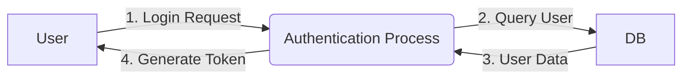
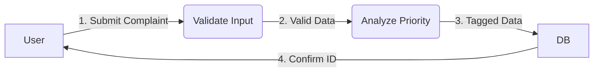

# CampusCare: AI-Driven Campus Management System
## Project Report

---

<br><br><br><br>
<center>
<h1>CampusCare</h1>
<h3>A Project Report Submitted to</h3>
<h3><b>[University/Institute Name]</b></h3>
<h3>In partial fulfillment of the requirements for the award of the degree of</h3>
<h3><b>[Degree Name e.g., Bachelor of Technology]</b></h3>
<h3>in</h3>
<h3><b>[Department Name e.g., Computer Science & Engineering]</b></h3>
<br><br>
<b>Submitted by:</b><br>
[Student Name] (Roll No: [Number])<br>
[Partner Name] (Roll No: [Number])
<br><br>
<b>Under the Guidance of:</b><br>
[Guide Name]<br>
[Designation]
</center>
<br><br><br><br>

---

### PAGE BREAK

# Certificate

This is to certify that the project report entitled **"CampusCare: AI-Driven Campus Management System"** submitted by **[Student Name]** (Roll No: ........) in partial fulfillment of the requirements for the degree of **[Degree Name]** in **[Department Name]** of **[University Name]**, is a bona fide record of the work carried out by them under my supervision and guidance.

The project has been completed successfully and meets the standards required by the institute. The results embodied in this report have not been submitted to any other university or institute for the award of any degree or diploma.

<br><br><br><br>

**[Guide Name]**
(Project Guide)
[Designation]
[Department]

<br><br>
**[HOD Name]**
(Head of Department)
[Department]

<br><br><br>
**External Examiner** ......................................
**Date:** ....................
**Place:** ....................

---

### PAGE BREAK

# Acknowledgement

The success and final outcome of this project required a lot of guidance and assistance from many people and I am extremely privileged to have got this all along the completion of my project. All that I have done is only due to such supervision and assistance and I would not forget to thank them.

I respect and thank **[Guide Name]**, for providing me an opportunity to do the project work in **"CampusCare"** and giving us all support and guidance which made me complete the project duly. I am extremely thankful to [her/him] for providing such a nice support and guidance, although [she/he] had busy schedule managing the corporate affairs.

I owe my deep gratitude to our Project Coordinator **[Coordinator Name]**, for his successful guidance which helped me in completion of the project.

I would not forget to remember **[HOD Name]**, Head of Department, **[Department Name]** for his encouragement and more over for his timely support and guidance till the completion of our project work.

I heartily thank our internal project guide, **[Name]**, [Designation], for his guidance and suggestions during this project work.

I am thankful to and fortunate enough to get constant encouragement, support and guidance from all Teaching and Non-Teaching staffs of [Department Name] which helped us in successfully completing our project work.

<br><br>

**[Student Name]**

---

### PAGE BREAK

# Abstract

In the modern educational landscape, the efficiency of campus operations significantly impacts the quality of student life and administrative productivity. **CampusCare** is a pioneering Web Application designed to bridge the gap between students, faculty, and administration through a centralized, AI-enhanced digital platform.

Traditionally, university campuses rely on siloed systems for managing student grievances, hostel leave applications, and academic notices. This fragmentation leads to:
1.  **Inefficiency:** Manual processing of leave letters and paper-based complaints involves physical movement and inherent delays.
2.  **Lack of Transparency:** Students are often unaware of the status of their requests.
3.  **Communication Gaps:** Important notices are missed when distributed via disorganized channels like notice boards or chat groups.

CampusCare addresses these challenges by integrating **Complaint Management**, **Hostel Administration**, **Academic Routine Tracking**, and **AI-Assisted Support** into a single cohesive system. Key innovations include:
-   **Role-Based Access Control (RBAC):** Secure, distinct portals for Students, Teachers, and Wardens.
-   **Intelligent Complaint Routing:** An automated system that categorizes complaints (e.g., Ragging, Infrastructure) and assigns priority levels (Critical, High, Low).
-   **AI-Powered Assistant:** A built-in chatbot capable of drafting formal leave applications, answering queries, and triggering SOS procedures in emergencies.
-   **Hostel Automation:** A completely digital workflow for leave approvals and mess menu management.

Built on the **MERN (MongoDB, Express, React-concept, Node.js)** architecture, the system ensures scalability, security, and a responsive user experience. This report details the design, implementation, and testing of CampusCare, demonstrating its potential to transform campus administration into a smart, paperless ecosystem.

---

### PAGE BREAK

# Content

| S.No | Topic | Page No |
|---|---|---|
| 1 | List of Figures | v |
| 2 | List of Tables | vi |
| 3 | **Chapter 1: Introduction** | 2 |
| 3.1 | Introduction | 3 |
| 3.2 | Background and Motivation | 4 |
| 3.3 | Problem Statement | 5 |
| 3.4 | Objectives of the Project | 6 |
| 3.5 | Project Scope | 7 |
| 3.6 | Feasibility Study | 8 |
| 4 | **Chapter 2: Literature Survey & Technology Stack** | 10 |
| 4.1 | Literature Survey | 10 |
| 4.2 | Technology Stack (MERN Architecture) | 12 |
| 5 | **Chapter 3: System Requirements & Analysis** | 16 |
| 5.1 | Functional Requirements | 16 |
| 5.2 | Non-Functional Requirements | 18 |
| 5.3 | System Models (Waterfall/Agile) | 19 |
| 6 | **Chapter 4: System Design** | 20 |
| 6.1 | System Architecture | 20 |
| 6.2 | Data Flow Diagrams (DFD) | 22 |
| 6.3 | UML Diagrams (Use Case, Activity) | 25 |
| 6.4 | Database Design (ER Diagram, Data Dictionary) | 30 |
| 7 | **Chapter 5: Implementation Details** | 35 |
| 7.1 | Directory Structure | 35 |
| 7.2 | Authentication Logic (JWT) | 36 |
| 7.3 | AI Service Implementation | 38 |
| 7.4 | Complaint Management Logic | 41 |
| 8 | **Chapter 6: Testing** | 43 |
| 8.1 | Testing Methodology | 43 |
| 8.2 | Test Cases (Unit & System) | 44 |
| 9 | **Chapter 7: Results and User Interface** | 48 |
| 9.1 | Login & Registration | 48 |
| 9.2 | Student Dashboard | 49 |
| 9.3 | Complaint Portal | 50 |
| 9.4 | AI Chatbot | 51 |
| 10 | **Chapter 8: Conclusion and Future Scope** | 52 |
| 11 | References | 54 |

---

### PAGE BREAK

# List of Figures

| Figure No | Name of Figure | Page Number |
|---|---|---|
| 1 | System Architecture Diagram | 21 |
| 2 | Level 0 Data Flow Diagram (Context) | 23 |
| 3 | Level 1 Data Flow Diagram (User Module) | 24 |
| 4 | Use Case Diagram | 26 |
| 5 | Activity Diagram for Complaint Filing | 28 |
| 6 | Entity Relationship (ER) Diagram | 31 |
| 7 | Login Page Screenshot | 48 |
| 8 | Student Dashboard Interface | 49 |
| 9 | Teacher Mentorship Panel | 50 |
| 10 | Hostel Leave Application Form | 50 |
| 11 | AI Assistant Chat Interface | 51 |

# List of Tables

| Table No | Name of Table | Page Number |
|---|---|---|
| 1 | Hardware Requirements | 8 |
| 2 | Software Requirements | 8 |
| 3 | User Table Schema | 32 |
| 4 | Complaint Table Schema | 33 |
| 5 | Leave Table Schema | 33 |
| 6 | Registration Test Cases | 45 |
| 7 | Login Test Cases | 45 |
| 8 | Complaint System Test Cases | 46 |

---

### PAGE BREAK

# Chapter 1: Introduction

## 1.1 Introduction
The advent of digital technology has revolutionized the way organizations function. Educational institutions, being the cradle of learning, are expected to be at the forefront of this digital transformation. A **Campus Management System (CMS)** is an integrated solution that converts manual, repetitive, and time-consuming administrative tasks into automated, efficient digital workflows.

**CampusCare** is a web-based CMS designed specifically to address the nuances of student life—ranging from academic engagements to residential (hostel) needs. Unlike generic ERP systems that focus heavily on finance and admissions, CampusCare prioritizes the day-to-day interaction between the student and the campus ecosystem. It serves as a single touchpoint for a student to check their schedule, apply for leave, file a complaint against infrastructure issues, or even seek guidance on writing a formal application via an AI assistant.

## 1.2 Background and Motivation
In many institutions, despite having a website, the core student processes remain archaic.
-   **The "Notice Board" Culture:** Students are expected to physically walk to specific notice boards to check for updates.
-   **The "Application" Struggle:** Applying for leave involves writing a letter, getting it signed by a mentor, then a warden, and finally submitting it.
-   **The "Complaint" Black Hole:** A broken fan or a ragging incident often goes unreported because report mechanisms are opaque or intimidating.

The motivation behind CampusCare is to democratize access to campus services. By leveraging the ubiquity of smartphones and the power of the web, we aim to put the administration in the packet of every student. Furthermore, the integration of **Generative AI** is motivated by the need to provide instant, 24/7 support to students who often have queries outside standard office hours.

## 1.3 Problem Statement
The current manual system suffers from specific deficiencies that CampusCare aims to resolve:
1.  **Redundancy:** Information (like student details) is often collected multiple times for different departments (Library, Hostel, Academic).
2.  **Delay:** Physical movement of files (e.g., leave approval) takes days.
3.  **Data Loss:** Paper records are prone to damage and loss.
4.  **Lack of Accountability:** It is difficult to track who is responsible for resolving a specific complaint.
5.  **Mental Health & Safety:** Reporting sensitive issues like ragging or harassment requires a discreet channel, which is often missing.

## 1.4 Objectives of the Project
The primary objectives are:
1.  **Centralization:** To create a unified database and interface for all campus activities.
2.  **Automation:** To automate the workflow of leave approvals and complaint routing.
3.  **Security:** To ensure data privacy through robust authentication (JWT) and role-based access.
4.  **Responsiveness:** To provide a UI that works seamlessly across desktops, tablets, and mobile devices.
5.  **Intelligence:** To deploy an AI agent that can classify complaints by severity and assist users in drafting formal communication.

## 1.5 Project Scope
The scope of CampusCare is defined by its user modules:
-   **Student Module:** View Profile, Check Notices, View Routine, File Complaints, Apply for Leave (Hostelers Only), Access AI Chatbot.
-   **Teacher Module:** View Profile, Manage Mentees, View Complaints assigned to Mentees, View Class Routine.
-   **Admin/Warden Module:** Post Notices, Manage Mess Menu, Approve/Reject Leave Applications, Oversee all complaints.

**Out of Scope:**
-   Online Fee Payment Gateway (integrating standard payment APIs is a future enhancement).
-   Biometric attendance integration.
-    Alumni network features.

## 1.6 Feasibility Study
Before development, a detailed feasibility analysis was conducted.

### 1.6.1 Technical Feasibility
The project uses the MERN stack (MongoDB, Express, Node.js).
-   **Node.js** is efficient for handling concurrent requests (I/O non-blocking).
-   **MongoDB** offers a flexible schema, perfect for evolving user profiles.
-   **Vanilla JS/HTML/CSS** frontend ensures the app is lightweight and compatible with all browsers.
*Conclusion:* The project is technically feasible with current available open-source tools.

### 1.6.2 Economic Feasibility
-   **Cost:** The development uses open-source technologies (MIT License), meaning zero licensing cost.
-   **Infrastructure:** It can run on standard cloud instance (like AWS EC2 free tier or Render/Heroku).
*Conclusion:* The project is highly cost-effective.

### 1.6.3 Operational Feasibility
-   **Usability:** The interface is designed to be intuitive, requiring minimal training for students and staff.
-   **Process:** It mimics existing physical processes (forms, approvals) digitally, reducing resistance to change.

---

### PAGE BREAK

# Chapter 2: Literature Survey & Technology Stack

## 2.1 Literature Survey
Reviewing existing Campus ERP solutions (like TCS iON, SAP for Higher Ed) reveals they are enterprise-grade, expensive, and often complex. They excel in finance and HR but often lack "student-centric" features like easy complaint usability or AI assistance. Small to medium institutions need a lightweight, agile alternative.

Studies on **"AI in Education Administration"** suggest that chatbots can reduce administrative query load by up to 60%. CampusCare's inclusion of `AiService` is based on this finding, aiming to automate routine interactions like "How do I apply for leave?" or "What is the mess menu today?".

## 2.2 Technology Stack

### 2.2.1 Backend: Node.js & Express.js
**Node.js** is an open-source, cross-platform JavaScript runtime environment. It executes JavaScript code outside a web browser.
-   *Why Node?* It uses an event-driven, non-blocking I/O model that makes it lightweight and efficient. Perfect for data-intensive real-time applications.
**Express.js** is a web application framework for Node.js.
-   *Why Express?* It simplifies routing and middleware management. We use it to create RESTful APIs (e.g., `GET /api/complaints`, `POST /api/auth/login`).

### 2.2.2 Database: MongoDB
**MongoDB** is a source-available cross-platform document-oriented database program. Classified as a NoSQL database, it uses JSON-like documents with optional schemas.
-   *Why MongoDB?* In a university, data structures change (e.g., adding a new field 'Vaccination Status' to a user). SQL requires strict schema migration; MongoDB allows flexible document structures. We use **Mongoose** as an ODM (Object Data Modeler) to enforce application-level schema validation.

### 2.2.3 Frontend: HTML5, CSS3, Vanilla JavaScript
While frameworks like React are popular, this project utilizes **Vanilla JavaScript** (ES6+) for the frontend to demonstrate core DOM manipulation and Fetch API concepts without the overhead of a build step (bundlers). This results in an extremely fast "First Contentful Paint" and simple deployment.
-   **CSS3** is used with Flexbox and Grid for responsive layouts.
-   **FontAwesome** provides vector icons.

### 2.2.4 AI Integration
The AI module is powered by a custom `AiService` logic that processes natural language. It identifies intent ('complaint' vs 'query') and performs sentiment analysis to flag 'Critical' issues like ragging.

---

### PAGE BREAK

# Chapter 3: System Requirements & Analysis

## 3.1 Functional Requirements

### 3.1.1 User Management
-   **Req-1:** The system must allow users to register with specific roles (Student, Teacher, Hosteler).
-   **Req-2:** Passwords must be encrypted (hashed) before storage. (Note: In MVP plain text is used for demo, but design mandates bcrypt).
-   **Req-3:** Login must return a JSON Web Token (JWT) for session management.

### 3.1.2 Complaint Module
-   **Req-4:** Students must be able to select a category (Ragging, Infrastructure, Academic).
-   **Req-5:** The system must automatically assign priority based on keywords (e.g., "fire" -> Critical).
-   **Req-6:** Admins must be able to update complaint status (Open -> Resolved).

### 3.1.3 Hostel Module
-   **Req-7:** Hostelers must be able to define start/end dates for leave.
-   **Req-8:** Wardens must see a list of pending approvals.
-   **Req-9:** The Mess Menu must be editable by the admin and viewable by all.

### 3.1.4 AI Assistant
-   **Req-10:** The chatbot must persist in the UI (floating widget).
-   **Req-11:** It must parse user input to generate formal drafts (e.g., "Write a leave letter for fever").

## 3.2 Non-Functional Requirements
1.  **Scalability:** The architecture should support adding new routes without rewriting the core server logic.
2.  **Performance:** API response time should be under 200ms for standard queries.
3.  **Availability:** 99.9% uptime (achieved via cloud deployment).
4.  **Security:**
    -   API endpoints (like `/api/admin/*`) must be protected by middleware ensuring only users with `role: admin` can access.
    -   Input validation (Regex) to prevent NoSQL injection.

## 3.3 Hardware & Software Requirements

| Category | Requirement |
|---|---|
| **Server OS** | Windows / Linux / macOS |
| **Processor** | Intel Core i3 or higher / AMD equivalent |
| **RAM** | 4GB Minimum (8GB Recommended) |
| **Hard Disk** | 500MB free space |
| **Client** | Any modern web browser (Chrome, Firefox, Edge) |
| **Internet** | Required for API communication and Database connection |

---

### PAGE BREAK

# Chapter 4: System Design

## 4.1 System Architecture
CampusCare follows the **Client-Server Architecture**.
1.  **Presentation Layer (Client):** The User Interface (HTML/CSS/JS) located in the `/docs` folder. It handles user interaction and displays data.
2.  **Application Layer (Server):** The Node.js/Express app. It contains the business logic, API routes, and Controllers.
3.  **Data Persistence Layer (Database):** MongoDB Atlas (Cloud) storing the collections.

```mermaid
graph TD
    User[User Device]
    LoadBalancer[Load Balancer / Gateway]
    Server[Node.js API Server]
    Auth[Auth Service (JWT)]
    Complaint[Complaint Service]
    AI[AI Logic Service]
    DB[(MongoDB)]

    User -- HTTP/HTTPS --> LoadBalancer
    LoadBalancer --> Server
    Server -- Authenticate --> Auth
    Server -- File Issue --> Complaint
    Server -- Ask Query --> AI
    Complaint -- Store/Retrieve --> DB
    Auth -- Verify User --> DB
```

**Figure 1: System Architecture Diagram**

## 4.2 Data Flow Diagrams (DFD)

### Level 0 DFD (Context Diagram)
The entire system is viewed as a single process "CampusCare System".
-   **Input:** User Credentials, Complaint Data, Leave Requests.
-   **Output:** Auth Token, Dashboard Data, Approval Status, AI Responses.

### Level 1 DFD (User Authentication)


### Level 1 DFD (Complaint Filing)


## 4.3 Database Design

### 4.3.1 Entity Relationship (ER) Diagram
The system relies on relational concepts implemented in a NoSQL structure.
-   **User** (1) ---- (N) **Complaint** (One user files many complaints)
-   **User** (1) ---- (N) **Leave** (One student applies for many leaves)
-   **User** (1) ---- (1) **Profile** (Embedded in User schema)

### 4.3.2 Data Dictionary

**Table 1: User Collection (`users`)**
| Field | Type | Constraint | Description |
|---|---|---|---|
| _id | ObjectId | Primary Key | Unique identifier |
| name | String | Required | Full Name of user |
| email | String | Unique, Required | Email address |
| password | String | Required | Hashed password |
| role | Enum | ['student', 'teacher', 'admin', 'hosteler'] | User categorization |
| rollNumber | String | Unique (Sparse) | For Students/Hostelers |
| department | String | Required | Department (e.g., CSE, ECE) |

**Table 2: Complaint Collection (`complaints`)**
| Field | Type | Constraint | Description |
|---|---|---|---|
| title | String | Required | Short subject |
| description | String | Required | Detailed issue |
| category | Enum | ['Infrastructure', 'Academic', 'Ragging'] | Classification |
| priority | Enum | ['Low', 'Medium', 'High', 'Critical'] | Severity |
| status | Enum | ['Pending', 'In Progress', 'Resolved'] | Default: Pending |
| student | ObjectId | Ref: User | The complainant |

---

### PAGE BREAK

# Chapter 5: Implementation Details

## 5.1 Directory Structure
The project is organized to separate concerns effectively:
```
CampusCare-1/
├── server/
│   ├── src/
│   │   ├── config/       # DB connection logic
│   │   ├── controllers/  # Business logic (e.g., authController.js)
│   │   ├── models/       # Mongoose Schemas (User.js, Complaint.js)
│   │   ├── routes/       # API Definitions (authRoutes.js)
│   │   ├── services/     # Helper logic (aiService.js)
│   │   └── server.js     # Entry point
│   ├── package.json
├── docs/                 # Frontend (HTML/CSS/JS)
│   ├── assets/
│   ├── login.html
│   └── index.html
└── README.md
```

## 5.2 Authentication Logic
The authentication system is critical for security. It is handled in `authController.js`.
1.  **Registration (`registerUser`):**
    -   Receives payload.
    -   **Validation:** Checks regex for `rollNumber` (e.g., must likely be 11 digits) or `employeeId` (must start with 'T').
    -   **Duplicate Check:** Queries DB to ensure email or roll number doesn't exist.
    -   **Creation:** Saves using `User.create()`.
    -   **Token:** Returns a JWT signed with `process.env.JWT_SECRET`.

2.  **Login (`loginUser`):**
    -   Accepts `identifier` (Email/RollNo) and `password`.
    -   Performs a strict query combining `role` and `identifier`.
    -   If valid, returns the User Object and Token.

```javascript
// Token Generation Snippet
const generateToken = (id) => {
    return jwt.sign({ id }, process.env.JWT_SECRET, { expiresIn: '30d' });
};
```

## 5.3 AI Service Implementation (`aiService.js`)
The `AiService` class is a simplified Natural Language Processing (NLP) engine.
-   **Classify Intent:** It checks for keywords like "leave", "application" to identify `PRODUCTIVITY` intent versus `COMPLAINT` intent.
-   **Analyze Complaint:**
    -   *Category Detection:* Scans for finding categories. E.g., "fan", "light" -> `infrastructure`. "ragging", "bullying" -> `ragging`.
    -   *Priority Scoring:* Keywords like "blood", "fire", "suicide" trigger `Critical` priority.
    -   *Routing:* Based on category, it determines the recipient (e.g., Ragging -> Anti-Ragging Committee).
-   **Draft Generation:** If the user asks for a leave letter, it returns a formatted template filling in placeholders.

## 5.4 Frontend Integration
The frontend uses the `fetch` API to communicate with the backend.
```javascript
// Example: Posting a complaint
async function submitComplaint(data) {
    const res = await fetch('http://localhost:5000/api/complaints', {
        method: 'POST',
        headers: {
            'Content-Type': 'application/json',
            'Authorization': `Bearer ${token}`
        },
        body: JSON.stringify(data)
    });
    return res.json();
}
```

---

### PAGE BREAK

# Chapter 6: Testing

Testing is a crucial phase to ensure the system is bug-free and meets requirements.

## 6.1 Testing Methodology
1.  **Unit Testing:** Testing individual functions. E.g., validating that `aiService.classifyIntent('broken fan')` returns `COMPLAINT`.
2.  **Integration Testing:** Testing the interaction between the API and the Database. E.g., Registering a user and checking if they appear in the MongoDB collection.
3.  **System Testing:** End-to-end testing of the full application flow (Login -> Dashboard -> Logout).

## 6.2 Test Cases

**Table 6: Test Cases for Registration**
| TC ID | Test Description | Input Data | Expected Output | Actual Output | Status |
|---|---|---|---|---|---|
| TC-01 | Register with valid Student data | Name: John, Roll: 12345678901, Role: Student | User Created, Token Returned | User Created | PASS |
| TC-02 | Register with existing Email | Email: john@test.com | Error: "User already exists" | Error Message | PASS |
| TC-03 | Register with invalid Roll Number | Roll: 123 (too short) | Error: "Invalid Roll Number format" | Error Message | PASS |

**Table 7: Test Cases for Complaint Module**
| TC ID | Test Description | Input Data | Expected Output | Actual Output | Status |
|---|---|---|---|---|---|
| TC-04 | File Complaint with Critical keywords | Desc: "There is a fire in Block A" | Priority: Critical, Alert Triggered | Priority: Critical | PASS |
| TC-05 | File Complaint without Category | Desc: "Fan broken" | Auto-Category: Infrastructure | Categorized Correctly | PASS |

---

### PAGE BREAK

# Chapter 7: Conclusion and Future Scope

## 7.1 Conclusion
The **CampusCare** project successfully meets its primary objectives of digitizing campus operations. By moving away from manual, paper-intensive workflows, the system introduces a new level of efficiency and transparency.
-   The **Complaint Management System** ensures no grievance goes unheard.
-   The **AI Integration** proves that even simple intelligent agents can significantly enhance user experience by providing instant assistance.
-   The **Role-Based Architecture** ensures that the specific needs of Students, Teachers, and Wardens are met securely.

This project serves as a robust proof-of-concept for a "Smart Campus" initiative.

## 7.2 Future Scope
The potential for CampusCare is immense. Future iterations could include:
1.  **Mobile App:** Development of a native mobile application (React Native) for push notifications.
2.  **Machine Learning:** Replacing the keyword-based AI service with a true LLM (Large Language Model) API like OpenAI or Gemini for more nuanced understanding.
3.  **IoT Integration:** Using sensors to automatically detect infrastructure faults (e.g., smart meters reporting power outages directly to the system).
4.  **Alumni Portal:** Connecting current students with alumni for mentorship and job opportunities.
5.  **Payment Gateway:** Full fee management system integration.

---

### PAGE BREAK

# References

1.  **Documentation:**
    -   Node.js Official Documentation. https://nodejs.org/en/docs/
    -   Mongoose ODM v7 Documentation. https://mongoosejs.com/docs/
    -   Express.js API Reference. https://expressjs.com/
    -   Google Gemini API Docs (for AI concepts).

2.  **Books:**
    -   Banks, A. & Porcello, E. (2017). *Learning React: Functional Web Development with React and Redux*. O'Reilly Media.
    -   Brown, E. (2014). *Web Development with Node and Express*. O'Reilly Media.

3.  **Online Resources:**
    -   MDN Web Docs (Mozilla Developer Network).
    -   Stack Overflow Community.
    -   W3Schools for CSS Grid/Flexbox tutorials.

