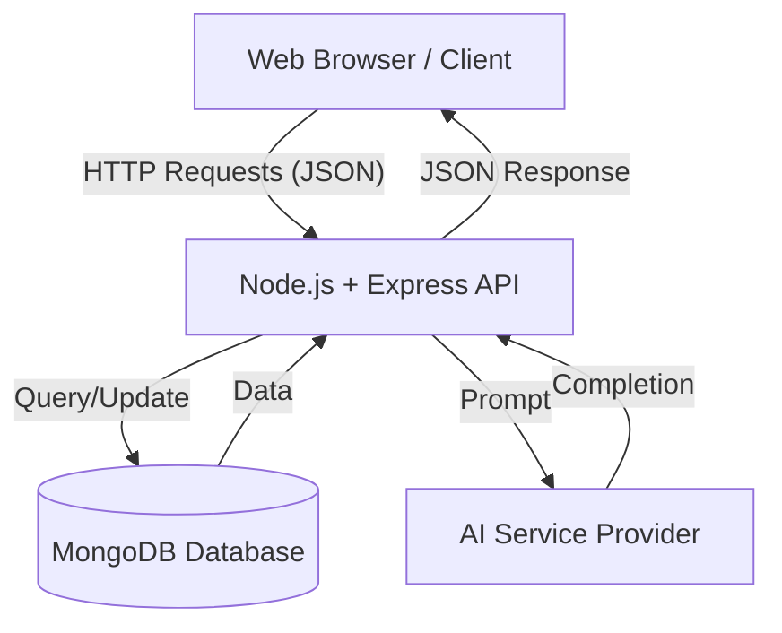
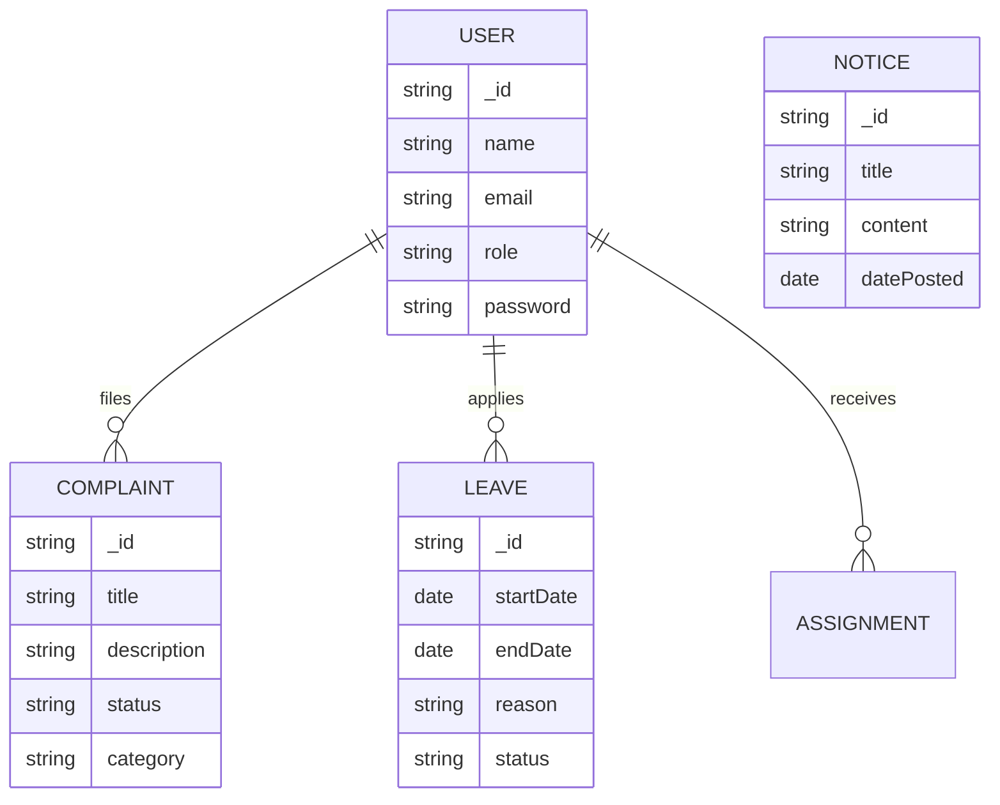

# CampusCare: AI-Driven Campus Management System
## Project Report

---

**Submitted by:**
[Student Name]
[Roll Number]

**Under the Guidance of:**
[Guide Name]
[Designation]

---

### PAGE BREAK

# Certificate

This is to certify that the project report entitled **"CampusCare"** submitted by **[Student Name]** in partial fulfillment of the requirements for the degree of **[Degree Name]** is a bona fide work carried out by them under my supervision and guidance.

The project has been completed successfully and meets the standards required by the university/institute.

<br><br><br>

**[Guide Name]**
(Project Guide)

**[HOD Name]**
(Head of Department)

**Date:** ....................
**Place:** ....................

---

### PAGE BREAK

# Acknowledgement

I would like to express my deepest gratitude to my project guide, **[Guide Name]**, for their invaluable guidance, constant feedback, and support throughout the development of this project.

I am also thankful to **[HOD Name]**, Head of the Department of **[Department Name]**, for providing the necessary facilities and encouragement.

Special thanks to my friends and family for their patience and understanding during the course of this work. Their support has been a source of motivation for me.

<br><br>

**[Student Name]**

---

### PAGE BREAK

# Content

| S.No | Topic | Page No |
|---|---|---|
| 1 | List of Figures/Tables | v |
| 2 | Project Synopsis | 1 |
| 3 | **Chapter 1: Introduction** | 2 |
| 3.1 | Overview | 3 |
| 3.2 | Problem Statement | 4 |
| 3.3 | Objectives | 5 |
| 3.4 | Scope of the Project | 6 |
| 3.5 | Technology Stack | 7 |
| 4 | **Chapter 2: Project Details** | 8 |
| 4.1 | System Architecture | 8 |
| 4.2 | Functional Modules | 10 |
| 4.3 | Database Design (ER Diagram) | 15 |
| 4.4 | Data Flow Diagrams | 18 |
| 4.5 | User Interface Implementation | 22 |
| 5 | **Chapter 3: Conclusion and Recommendations** | 28 |
| 6 | References | 30 |

---

### PAGE BREAK

# List of Figures / Tables

| Figure No | Name of Figure | Page Number |
|---|---|---|
| 1 | System Architecture Diagram | 9 |
| 2 | Use Case Diagram | 11 |
| 3 | High-Level Data Flow Diagram | 19 |
| 4 | Entity Relationship (ER) Diagram | 16 |
| 5 | Login Page Screenshot | 23 |
| 6 | Dashboard Screenshot | 24 |
| 7 | Complaint Management Screenshot | 25 |
| 8 | AI Assistant Chat Interface | 26 |

---

### PAGE BREAK

# Project Synopsis

**Project Title:** CampusCare - AI-Driven Campus Management System

**Domain:** Web Application / Education Technology

**Platform:** Web (responsive)

**Backend:** Node.js, Express.js (REST API)
**Frontend:** HTML5, CSS3, JavaScript
**Database:** MongoDB
**AI Integration:** Generative AI for Assistance

**Abstract:**

"CampusCare" is a comprehensive, centralized web-based platform designed to streamline and automate the daily operations of an educational institution. Traditional campus management often relies on fragmented systems or manual paperwork for tasks like complaint handling, notice distribution, classroom resource management, and hostel administration. This inefficiency leads to delayed responses, lack of transparency, and administrative bottlenecks.

CampusCare addresses these challenges by integrating multiple modules into a single interface. Key features include a robust **Complaint Management System** where students can log issues (infrastructure, academic, ragging) that are automatically routed to the relevant authorities or mentors. A **Hostel Management** module facilitates leave applications, mess menu displays, and room allocation tracking. The **AI Assistant** provides 24/7 support to students, answering queries about schedules, rules, or campus events.

The system features distinct roles for **Students**, **Teachers**, **Hostel Wardens**, and **Admins**, ensuring secure and role-specific access. By leveraging modern web technologies and AI, CampusCare aims to create a paperless, efficient, and responsive digital campus environment, enhancing the quality of life for students and the productivity of the staff.

---

### PAGE BREAK

# Chapter 1: Introduction

## 1.1 Overview
In the era of digital transformation, educational institutions are increasingly moving towards smart campus solutions. A typical university ecosystem involves a complex interaction between students, faculty, administrative staff, and support services. **CampusCare** is envisioned as a digital bridge that connects these entities seamlessly.

The application serves as a central hub for academic and non-academic activities. It moves beyond simple student information systems (SIS) by incorporating interactive features like real-time complaint tracking, automated leave processing for hostelers, and an intelligent chatbot for instant assistance. The project is built using the **MERN-like stack** (MongoDB, Express, Node.js) but utilizes a lightweight vanilla JavaScript frontend for maximum performance and compatibility.

## 1.2 Problem Statement
Current campus management processes suffer from several deficiencies:
1.  ** Decentralized Information:** Notices are pasted on physical boards or sent via disparate WhatsApp groups, leading to missed information.
2.  **Slow Complaint Resolution:** Students often struggle to find the right channel to report broken amenities or academic grievances. Paper-based complaints are easily lost or ignored.
3.  **Manual Processes:** Hostel leave applications and mess management are often done manually, consuming time and creating storage issues for paper records.
4.  **Lack of Instant Support:** Students have queries outside office hours that go unanswered until the next working day.

## 1.3 Objectives
The primary objectives of the CampusCare project are:
1.  **To specific role-based access control (RBAC):** Secure login for Students, Teachers, and Admins.
2.  **To digitize complaint handling:** Create a transparent system for logging, tracking, and resolving grievances.
3.  **To automate hostel operations:** Simplify leave requests, mess management, and digital compliance.
4.  **To enhance communication:** Provide a centralized digital notice board accessible to all authorized users.
5.  **To integrate Artificial Intelligence:** Deploy an AI chatbot to handle routine queries and assist users in navigation.

## 1.4 Scope
**In Scope:**
*   **User Management:** Registration and authentication for multiple roles.
*   **Academic Module:** Assignment tracking, class routines (timetables), and library book search.
*   **Administrative Module:** Posting notices, managing users, and overseeing complaints.
*   **Hostel Module:** Leave application system, weekly mess menu display.
*   **AI Module:** A conversational interface for campus-related Q&A.

**Out of Scope:**
*   **Financial Transactions:** Fee payments gateway integration (planned for future phases).
*   **External Hardware Integration:** Biometric attendance devices (currently manual).

## 1.5 Technology Stack

### Frontend
*   **HTML5 & CSS3:** For structure and responsive styling.
*   **JavaScript (ES6+):** For client-side logic, API calls (Fetch API), and DOM manipulation.
*   **FontAwesome:** For iconography.

### Backend
*   **Node.js:** A JavaScript runtime built on Chrome's V8 engine, used for handling server-side logic efficiently.
*   **Express.js:** A minimal and flexible Node.js web application framework utilized for building robust APIs.

### Database
*   **MongoDB:** A NoSQL database program, using JSON-like documents with optional schemas. It allows for flexibility in data representation (e.g., varying user profiles).
*   **Mongoose:** An Object Data Modeling (ODM) library for MongoDB and Node.js.

### Tools & Libraries
*   **Git/GitHub:** For version control.
*   **VS Code:** Integrated Development Environment.
*   **Postman:** For API testing.

---

### PAGE BREAK

# Chapter 2: Project Details

## 2.1 System Architecture

The CampusCare system follows a classic **Model-View-Controller (MVC)** architectural pattern, adapted for an API-centric design.

*   **Client Layer:** The browser runs the HTML/JS application, sending HTTP requests (GET, POST, PUT, DELETE) to the server.
*   **Server Layer:** The Node.js/Express server receives requests, handles business logic (Authentication, Validation), and interacts with the database.
*   **Data Layer:** MongoDB stores all persistent data including user profiles, complaints, and notices.



**Figure 1: System Architecture Diagram**

## 2.2 Functional Modules

### 1. Authentication Module
*   **Files:** `authRoutes.js`, `authController.js`, `User.js`
*   **Functionality:** Handles user registration and login. Uses **JWT (JSON Web Tokens)** for stateless authentication. It supports role selection (Student, Teacher, Hosteler) during sign-up to tailor the dashboard experience.

### 2. Dashboard & User Interface
*   **Files:** `index.html`, `student/dashboard.html`, `teacher/dashboard.html`
*   **Functionality:** Upon login, users are redirected to their specific dashboards.
    *   **Student Dashboard:** View assignments, notices, routine; file complaints.
    *   **Teacher Dashboard:** Manage mentees, upload assignments, view routine.
    *   **Hostel Dashboard:** Apply for leave, view mess menu.

### 3. Complaint Management System
*   **Files:** `complaintRoutes.js`, `Complaint.js`
*   **Functionality:**
    *   **Creation:** Users can file generic or specific complaints (e.g., Ragging, Infrastructure).
    *   **Resolution:** Admins or Mentors can view and update the status of complaints (Pending -> Resolved).
    *   **Privacy:** Sensitive complaints like ragging can be flagged for high priority.

### 4. Hostel Administration
*   **Files:** `hostelRoutes.js`, `Leave.js`, `MessMenu.js`
*   **Functionality:**
    *   **Leave Application:** Students fill a digital form. Wardens (Admin) can approve/reject.
    *   **Mess Menu:** A dynamic table displaying the weekly menu, editable by the admin.

### 5. AI Assistant
*   **Files:** `aiRoutes.js`, `aiService.js`
*   **Functionality:** An integrated chat interface accessible from the navbar. It sends user queries to the backend, which interacts with a generative AI model to provide context-aware answers about the app or general campus queries.

## 2.3 Database Design

The database is powered by MongoDB. Below is the simplified Entity Relationship (ER) representation of the core schemas.



**Figure 4: Entity Relationship Diagram**

## 2.4 Data Flow Diagrams

### Level 0 DFD (Context Diagram)

```mermaid
graph LR
    User[User (Student/Teacher/Admin)] -- Login Credentials --> System(CampusCare System)
    System -- Auth Token --> User
    User -- Complaint Details --> System
    System -- Complaint Status --> User
    Admin[Administrator] -- Notice Details --> System
    System -- Dashboard View --> User
    System -- AI Response --> User
```

**Figure 3: Context Diagram**

## 2.5 Implementation Snippets

**Server Entry Point (`server.js`):**
The server is initialized using Express. It configures CORS for security and routes incoming requests to specific modules.

**Mongoose Schema Example (`User.js`):**
The User schema defines the structure for storing user data, including validation for required fields like email and password.

---

### PAGE BREAK

# Chapter 3: Conclusion and Recommendations

## 3.1 Conclusion
The **CampusCare** project successfully demonstrates how modern web technologies can transform campus administration. By moving from manual, paper-based workflows to a digital, centralized system, the project achieves:
1.  **Efficiency:** Reduced time in processing leaves and complaints.
2.  **Transparency:** Real-time tracking of requests and grievances.
3.  **Accessibility:** 24/7 access to information via the web portal and AI assistant.
4.  **Scalability:** The modular Node.js backend allows for easy addition of new features like fee payment or exam management in the future.

The system is robust, secure (using JWT), and user-friendly, catering to the diverse needs of students, faculty, and wardens.

## 3.2 Recommendations for Future Enhancement
To further improve the system, the following enhancements are recommended:
1.  **Mobile Application:** Developing a React Native or Flutter mobile app for better accessibility on smartphones.
2.  **Real-time Notifications:** Implementing WebSockets (Socket.io) for instant alerts when a notice is posted or a complaint status changes.
3.  **Payment Gateway:** Integration with Razorpay or Stripe for online fee submission.
4.  **Offline Support:** Adding PWA (Progressive Web App) capabilities to allow access to cached data (like timetables) without internet.

---

### PAGE BREAK

# References

1.  **Documentation:**
    *   Node.js Documentation: https://nodejs.org/en/docs/
    *   Express.js API Reference: https://expressjs.com/
    *   MongoDB Manual: https://www.mongodb.com/docs/manual/
    *   Mongoose ODM Docs: https://mongoosejs.com/docs/manual/

2.  **Books:**
    *   *Pro MERN Stack* by Vasan Subramanian.
    *   *Clean Code* by Robert C. Martin.

3.  **Tutorials & Resources:**
    *   MDN Web Docs (Mozilla Developer Network) for JavaScript and CSS best practices.
    *   Stack Overflow for troubleshooting development errors.

4.  **Tools Used:**
    *   Visual Studio Code
    *   Git & GitHub
    *   Postman API Client

