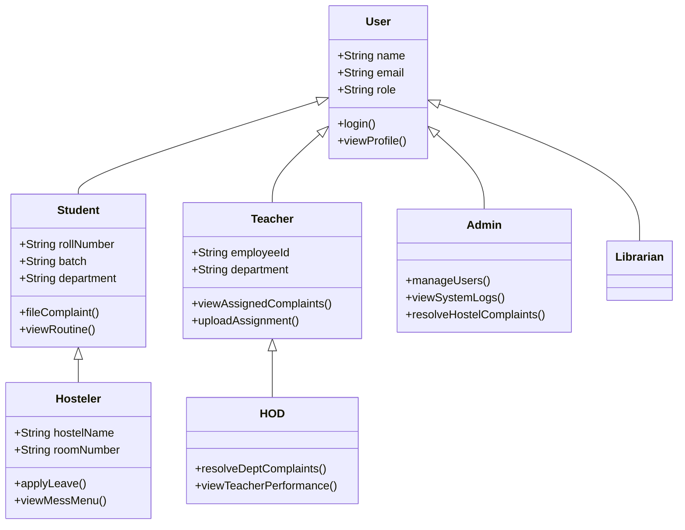
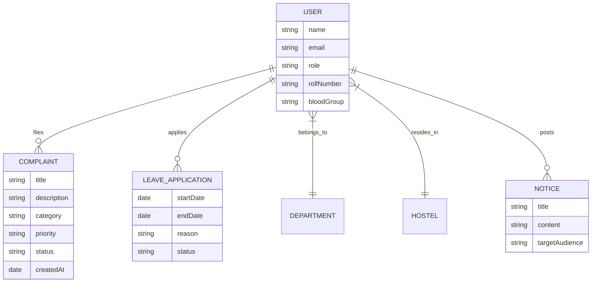
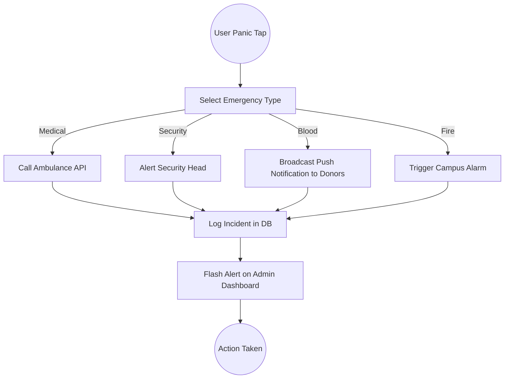
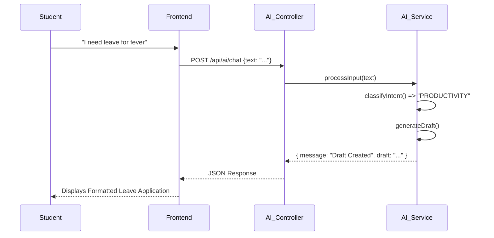
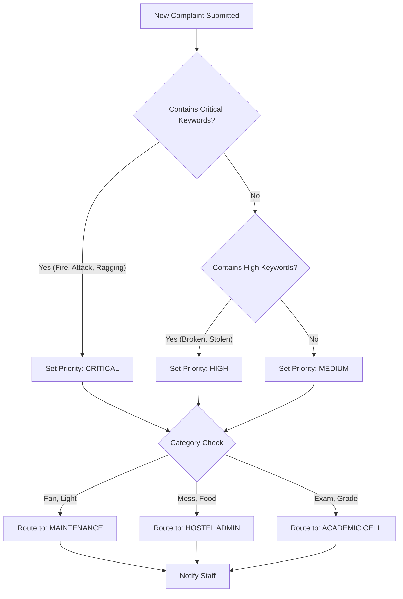
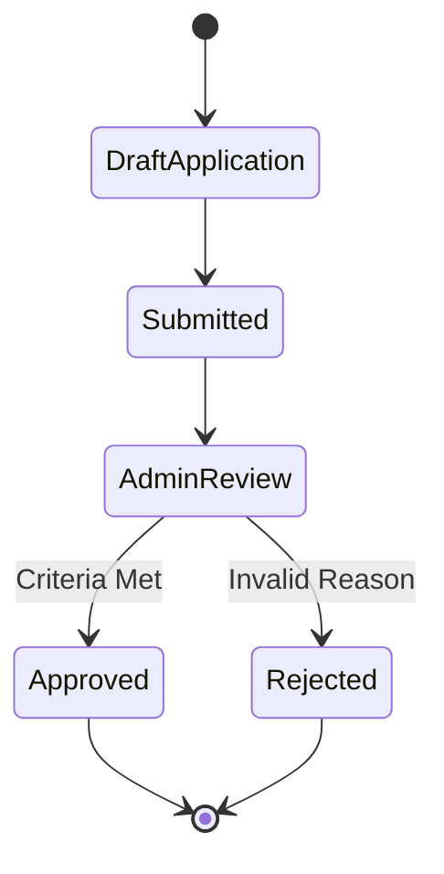

# Project Report: CampusCare
## AI-Driven Complaint Management & Campus Assistance System

<br>
<br>
<br>

**Project Synopsis**

**CampusCare** is a comprehensive, AI-driven web application designed to revolutionize the way educational institutions manage grievances, daily academic routines, and campus safety. Traditional complaint systems in colleges are often fragmented, opaque, and slow, leading to student frustration and a lack of accountability. CampusCare addresses the problem statement by providing a unified, transparent platform where students, faculty, and staff can interact seamlessly.

The core philosophy of CampusCare is **transparency and efficiency**. Unlike conventional systems where complaints disappear into a "black box," CampusCare ensures that every grievance filed is visible (appropriately), trackable, and routed to the correct department automatically using an intelligent AI engine. This transparency serves a dual purpose: it assures students that their problems are being addressed and provides hard-working backend staff—the administrators, maintenance crews, and HODs—with the credit they deserve for prompt resolutions. The system tracks reaction times and resolution rates, creating a meritocratic environment that encourages proactivity.

Beyond complaint management, CampusCare serves as a holistic **Campus Resource Planner**. It integrates features that students and teachers genuinely need but rarely find in a single platform:
- **AI Assistant**: A context-aware chatbot that answers queries about routines, menus, and rules.
- **Emergency SOS**: A one-tap safety feature for medical or security emergencies, broadcasting alerts to authorities.
- **Hostel Management**: Digital leave applications and mess menu tracking.
- **Academic Tools**: Personalized class routines, assignment tracking, and digital notice boards.

Developed using a robust **MERN-style architecture** (MongoDB, Express.js, Node.js) with a high-performance **Vanilla JavaScript** frontend, the project prioritizes speed and accessibility. The system employs a sophisticated hierarchical model, ensuring that access to sensitive data is strictly role-based, from students and teachers to HODs and Admin.

In summary, CampusCare is not just a complaint box; it is a smart, transparent, and credit-giving ecosystem that fosters a better campus life for everyone.

<div style="page-break-after: always;"></div>

# Chapter 1: Introduction

## 1.1 Problem Statement
In many educational institutions today, the mechanism for addressing student and staff grievances is archaic and inefficient. Students facing issues—whether related to infrastructure (broken lights, water shortage), academics (grading disputes, absenteeism), or social misconduct (ragging, harassment)—often find themselves running from pillar to post, unsure of whom to approach. 

The existing manual or semi-digital systems suffer from significant limitations:
1.  **Lack of Transparency**: Once a complaint is submitted, there is often no way to track its status. Students are left in the dark, leading to a perception of apathy from the administration.
2.  **Misrouting & Delays**: Complaints are frequently sent to the wrong department or get lost in bureaucratic red tape.
3.  **Lack of Recognition**: The hardworking staff members who actually resolve issues (e.g., the electrician who fixes the fan immediately, or the administrator who settles a dispute at midnight) rarely get official credit for their efficiency. Their efforts are invisible.
4.  **Siloed Information**: Academic routines, hostel notices, and library resources are scattered across different notice boards or WhatsApp groups, making information access chaotic.

Our college specifically lacks a centralized digital platform that democratizes this process. There is a critical need for a system where "everyone will know if a problem is genuine, how many people are facing it, and how cooperative the teachers are."

## 1.2 Objective
The primary objective of the **CampusCare** project is to design and develop a unified "AI-Driven Complaint Management and Campus Assistance System" that addresses the aforementioned gaps.

**Key Objectives:**
1.  **Centralized Grievance Redressal**: To create a single portal where any user (Student, Hosteler, Teacher) can report issues.
2.  **Transparency & Accountability**: To make the resolution process visible. Users should see *who* is working on their problem and *how fast* it is being resolved.
3.  **AI-Powered Automation**: To utilize Artificial Intelligence (Heuristic & NLP) to automatically classify complaints, determine their severity (Priority), and route them to the specific department (e.g., Electrical, Civil, Academic Cell, Anti-Ragging Committee).
4.  **Empowerment through Data**: To provide authorities (HODs, Principal) with dashboards showing real-time metrics on problem prevalence and staff performance.
5.  **Holistic Student Assistance**: To go beyond complaints by integrating daily utility features identified through data collection from students and teachers. This includes digitalizing:
    -   Hostel Leave Applications.
    -   Mess Menus.
    -   Class Routines.
    -   Assignments and Notices.
6.  **Safety**: To implement an immediate **SOS Emergency System** for critical situations like medical crises or security threats.

## 1.3 Scope of the Project
The scope of CampusCare extends to the entire campus ecosystem, covering Academic Blocks, Hostels, Libraries, and Administrative Departments.

**Functional Scope:**
-   **User Roles**: The system supports a comprehensive hierarchy including Students, Teachers, HODs, Hostelers, Wardens, Librarians, Alumni, and the Super Admin.
-   **Modules**:
    -   **Complaint Module**: Posting, Voting, Tracking, Resolving.
    -   **Hostel Module**: Leave requests, Room allocation (view only), Mess management.
    -   **Academic Module**: Routine display, Assignment submission links, MAR/MOOCs credit tracking.
    -   **Library Module**: Book availability checks and digital referencing.
    -   **Notice Board**: Centralized official digital notices.
    -   **AI & SOS**: Chatbot assistance and Emergency triggering.

**Technical Scope:**
-   **Frontend**: High-performance, lightweight **Vanilla JavaScript**, HTML5, and CSS3. Designed for maximum compatibility and speed without the overhead of heavy frameworks.
-   **Backend**: **Node.js** usage with **Express.js** framework for RESTful API services.
-   **Database**: **MongoDB** (NoSQL) for flexible schema storage, managing complex relationships between Users, Complaints, and Departments.
-   **AI Engine**: A custom Node.js-based heuristic engine for keyword analysis and priority tagging.

The project is designed to be scalable. While currently tailored for our college's specific hierarchy, the modular architecture allows it to be adapted for any residential educational institution.

<!-- APPEND_MARKER -->
<div style="page-break-after: always;"></div>

# Chapter 2: Project Details

## 2.1 Hierarchical Model & Access Control

CampusCare works on a strictly defined **Role-Based Access Control (RBAC)** model. This ensures that sensitive administrative functions are protected while general utility features remain accessible to all stakeholders.

### 2.1.1 Role Definitions
1.  **Student**: The core user. Can file complaints, view personal reports, access academic routines, and use the AI assistant.
2.  **Hosteler**: A specialized Student role with additional access to Hostel modules (Leave Application, Mess Menu).
3.  **Teacher**: Can view academic complaints, upload assignments, and manage class routines.
4.  **HOD (Head of Department)**: A senior role with oversight over all students and teachers within their department. Can View/Resolve departmental complaints.
5.  **Librarian**: Manages book inventory and digital library resources.
6.  **Admin**: The Super User. Has global access to all metrics, user management, and system configurations. Handles hostel-related issues in the absence of a dedicated warden module.

### 2.1.2 Hierarchical Role Diagram
The following class diagram illustrates the inheritance and relationships between the different user roles in the system.



### 2.1.3 Access Control Matrix
| Feature / Role | Student | Hosteler | Teacher | HOD | Admin |
| :--- | :---: | :---: | :---: | :---: | :---: |
| **Login/Auth** | ✅ | ✅ | ✅ | ✅ | ✅ |
| **File Complaint** | ✅ | ✅ | ❌ | ❌ | ❌ |
| **Apply Leave** | ❌ | ✅ | ❌ | ❌ | ❌ |
| **Resolve Acad Complaint** | ❌ | ❌ | ⚠️ (View) | ✅ | ✅ |
| **Resolve Hostel Complaint**| ❌ | ❌ | ❌ | ❌ | ✅ |
| **View All Users** | ❌ | ❌ | ❌ | ✅ | ✅ |
| **Manage Notices** | ❌ | ❌ | ✅ | ✅ | ✅ |
| **AI Chat & SOS** | ✅ | ✅ | ✅ | ✅ | ✅ |


<div style="page-break-after: always;"></div>

## 2.2 System Architecture

The system follows a modern **Client-Server Architecture** separated by RESTful APIs. 

### 2.2.1 Technology Stack
*   **Frontend**: Built with **HTML5, CSS3, and Vanilla JavaScript**. We deliberately expedited specific frameworks like React for the frontend to ensure maximum performance, lower bundle size, and easier dom-manipulation for specific custom animations.
*   **Backend**: **Node.js** runtime environment with **Express.js** handling the HTTP requests, routing, and middleware logic.
*   **Database**: **MongoDB**, a NoSQL database, chosen for its flexibility in handling unstructured data like complaint descriptions and varying user profiles (Student vs Teacher attributes).
*   **AI Service**: A dedicated logical layer within the Node.js backend that processes text input using heuristic algorithms for classification.

### 2.2.2 High-Level Architecture Diagram

```mermaid
graph TD
    subgraph Client_Side
        Browser[Web Browser]
        HTML[UI Pages (HTML/CSS)]
        JS[Client Logic (Vanilla JS)]
        Browser --> HTML
        HTML --> JS
    end

    subgraph Server_Side
        API[Express.js API Gateway]
        Auth[Auth Middleware]
        Controllers[Business Logic / Controllers]
        AI_Engine[AI Heuristic Engine]
        
        JS -- HTTP / JSON --> API
        API --> Auth
        Auth --> Controllers
        

        subgraph Modules
            UC[User Controller]
            CC[Complaint Controller]
            HC[Hostel Controller]
            AC[AI Controller]
        end
        
        Controllers --> UC
        Controllers --> CC
        Controllers --> HC
        Controllers --> AC
        AC <--> AI_Engine
    end

    subgraph Database
        MongoDB[(MongoDB Atlas)]
        Users[(User Collection)]
        Complaints[(Complaint Collection)]
        
        UC <--> Users
        CC <--> Complaints
        HC <--> Users
    end
```

<div style="page-break-after: always;"></div>

## 2.3 Database Design

The database schema is designed to be relational in nature despite using a NoSQL DB, using Mongoose `ObjectId` references to link Documents.

### 2.3.1 Entity Relationship Diagram (ERD)
This diagram represents the schema connections. Note how the **User** entity is central, connecting to complaints, department, and hostel records.



<!-- APPEND_MARKER -->
<div style="page-break-after: always;"></div>

## 2.4 Core Feature Modules (Detailed Analysis)

This section details the logic behind the "Smart" features of CampusCare, distinguishing it from standard databases.

### 2.4.1 SOS Emergency System
The SOS system is designed for immediate crises. It bypasses standard routing and triggers direct alerts. 
**Features:**
*   **Panic Button**: A single tap on the floating action button triggers the emergency mode.
*   **Categories**: Medical, Security/Ragging, Fire, Blood Requirement.
*   **Broadcasting**: (Simulated) functionality to alert nearby staff and security personnel.

#### SOS Alert Propagation Flowchart


### 2.4.2 AI Assistant (Campus Bot)
The AI Assistant ("CampusBot") acts as a first-line support agent. It uses a Heuristic Keyword Matching engine (Node.js) to understand user intent.
**Capabilities:**
*   **Query Answering**: "What is for lunch?", "Show me my routine."
*   **Drafting**: "Write an application for sick leave."
*   **Navigation**: "Where is the library?"

#### Chatbot Interaction Sequence Diagram


<div style="page-break-after: always;"></div>

### 2.4.3 Intelligent Complaint Management (AI Filter)
The heart of the system is the AI-driven complaint filter. It ensures that complaints are not just stored but *acted upon*.

**How it works:**
1.  **Keyword Analysis**: The engine scans the description for keywords (e.g., "spark", "wire" -> Electrical).
2.  **Severity Scoring**: Words like "danger", "fire", "ragging" boost the priority to 'Critical'.
3.  **Auto-Routing**: The system automatically assigns the complaint to the relevant department (e.g., Electrical Dept for wires, Anti-Ragging Cell for bullying).

#### Complaint Classification Logic Diagram


### 2.4.4 Hostel & Academic Modules
**Hostel Management**:
*   **Leave Application**: Students apply online; Admins/Staff approve/reject.
*   **Mess Menu**: Weekly visible menu.

**Academic Module**:
*   **Routine**: Personalized view based on Batch and Section.
*   **Assignments**: Teachers upload tasks; students view deadlines.

#### Leave Application Activity Diagram


<div style="page-break-after: always;"></div>

# Chapter 3: Conclusion and Recommendations

## 3.1 Conclusion
The **CampusCare** project successfully addresses the critical need for a transparent, efficient, and accountable complaint management system in educational institutions. By shifting from opaque manual processes to a centralized digital platform, we have empowered students to voice their grievances without fear of neglect and enabled the administration to monitor campus health in real-time.

Key achievements of the project include:
1.  **Democratization of Grievance Redressal**: Every stakeholder, from the freshman student to the Principal, has a clear view of the problem-solution lifecycle.
2.  **Recognition of Backend Staff**: By tracking resolution times, the system highlights the efficiency of administrators and maintenance staff, fostering a culture of appreciation.
3.  **Technological Innovation**: The integration of an AI Assistant and an automated heuristic router significantly reduces human error and administrative burden.
4.  **Holistic Assistance**: The inclusion of daily utility features like Leave Applications and Mess Menus ensures high user retention and daily engagement.

## 3.2 Future Implications & Scope
The current iteration of CampusCare lays a solid foundation, but the scope for expansion is vast.

### 3.2.1 Mobile Application Integration
While the current web application is responsive, a dedicated mobile app (Android/iOS) built using **React Native** or **Flutter** would offer:
*   **Push Notifications**: Instant alerts for complaint status updates or emergencies.
*   **Offline Mode**: Access to academic routines and downloaded notices without internet.

### 3.2.2 Advanced NLP & Voice Support
*   **Transformer Models**: Moving from heuristic keyword matching to advanced NLP models like **BERT** or fine-tuned **GPT** for deeper understanding of complex complaints (e.g., detecting subtle harassment or distress).
*   **Voice-to-Text**: Allowing students to file complaints or ask the chatbot questions via voice commands for greater accessibility.

### 3.2.3 Blockchain for Immutable Records
*   **Tamper-Proof Logging**: Storing complaint resolution logs and sensitive academic records (grades, certificates) on a private blockchain (e.g., Hyperledger) to prevent any unauthorized manipulation of history.

### 3.2.4 Predictive Analytics
*   **Infrastructure Health**: Using historical data to predict when equipment (e.g., hostel geysers, RO filters) is likely to fail and scheduling maintenance *before* a complaint is filed.
*   **Student Well-being**: Analyzing trends in keywords to detect spikes in stress or ragging-related terms during specific times of the year (e.g., exam season).

### 3.2.5 IoT Integration
*   **Smart Sensors**: Integrating IoT sensors in water tanks or electricity grids to automatically file a "Water Shortage" or "Power Cut" complaint without human intervention.

<div style="page-break-after: always;"></div>

# Chapter 4: Reference

## 4.1 Technical Documentation
1.  **MDN Web Docs (Mozilla)** - *JavaScript & HTML5 Reference*
    *   https://developer.mozilla.org/
2.  **Node.js Documentation** - *Backend Runtime Environment*
    *   https://nodejs.org/en/docs/
3.  **Express.js API Reference** - *Routing and Middleware*
    *   https://expressjs.com/
4.  **MongoDB Manual** - *NoSQL Database Modeling*
    *   https://www.mongodb.com/docs/manual/
5.  **Mongoose Library** - *Object Data Modeling (ODM) for Node.js*
    *   https://mongoosejs.com/docs/

## 4.2 Design & Tools
1.  **Mermaid.js** - *Diagramming Tool*
    *   https://mermaid.js.org/
2.  **FontAwesome** - *Iconography*
    *   https://fontawesome.com/
3.  **Google Fonts** - *Typography (Poppins)*
    *   https://fonts.google.com/

