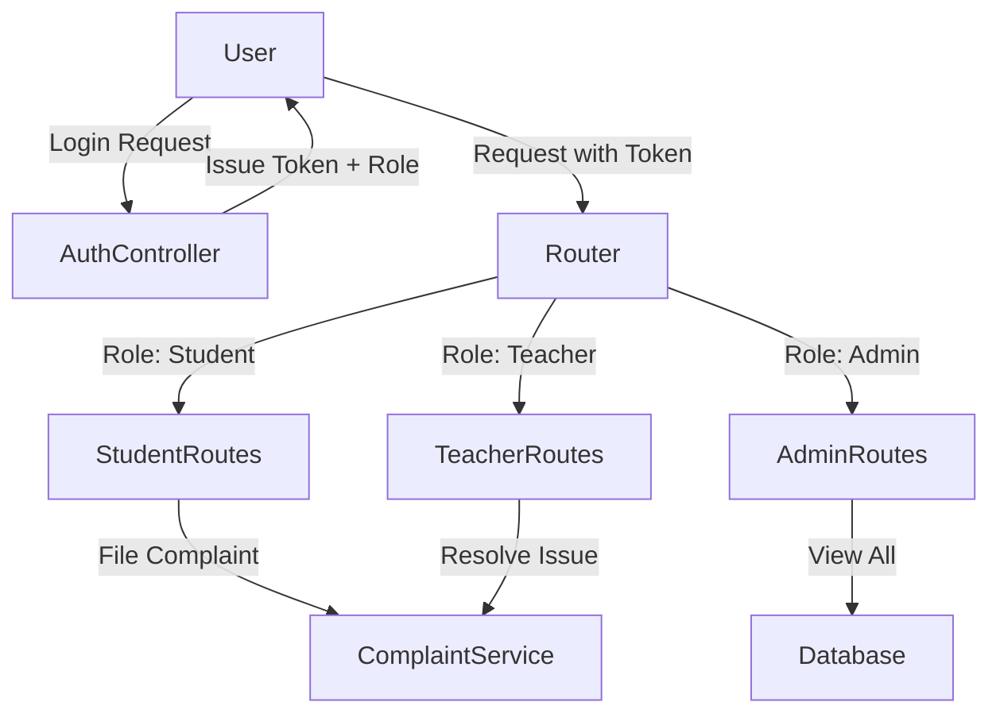

# CampusCare: AI-Driven Campus Management System
## Final Project Report

---

<br><br><br><br>
<center>
<h1>CampusCare</h1>
<h2>Next-Generation AI-Integrated Campus ERP</h2>
<h3>A Comprehensive Project Report Submitted to</h3>
<h3><b>[University/Institute Name]</b></h3>
<br>
<h3>In partial fulfillment of the requirements for the award of the degree of</h3>
<h3><b>[Degree Name e.g., Bachelor of Technology]</b></h3>
<h3>in</h3>
<h3><b>[Department Name e.g., Computer Science & Engineering]</b></h3>
<br><br><br>
<b>Submitted by:</b><br>
[Student Name] (Roll No: [Number])<br>
[Partner Name] (Roll No: [Number])
<br><br>
<b>Under the Guidance of:</b><br>
[Guide Name]<br>
[Designation]<br>
[Department]
</center>
<br><br><br><br>

---

### PAGE BREAK

# Certificate

This is to certify that the project report entitled **"CampusCare: AI-Driven Campus Management System"** submitted by **[Student Name]** (Roll No: ........) in partial fulfillment of the requirements for the degree of **[Degree Name]** in **[Department Name]** of **[University Name]**, is a bona fide record of the work carried out by them under my supervision and guidance.

The project has been completed successfully and meets the standards required by the institute. The results embodied in this report have not been submitted to any other university or institute for the award of any degree or diploma.

<br><br><br><br>

**[Guide Name]**
(Project Guide)
[Designation]
[Department]

<br><br>
**[HOD Name]**
(Head of Department)
[Department]

<br><br><br>
**External Examiner** ......................................
**Date:** ....................
**Place:** ....................

---

### PAGE BREAK

# Acknowledgement

The success and final outcome of this project required a lot of guidance and assistance from many people and I am extremely privileged to have got this all along the completion of my project. All that I have done is only due to such supervision and assistance and I would not forget to thank them.

I respect and thank **[Guide Name]**, for providing me an opportunity to do the project work in **"CampusCare"** and giving us all support and guidance which made me complete the project duly. I am extremely thankful to [her/him] for providing such a nice support and guidance, although [she/he] had busy schedule managing the corporate affairs.

I owe my deep gratitude to our Project Coordinator **[Coordinator Name]**, for his successful guidance which helped me in completion of the project.

I would not forget to remember **[HOD Name]**, Head of Department, **[Department Name]** for his encouragement and more over for his timely support and guidance till the completion of our project work.

I heartily thank our internal project guide, **[Name]**, [Designation], for his guidance and suggestions during this project work.

I am thankful to and fortunate enough to get constant encouragement, support and guidance from all Teaching and Non-Teaching staffs of [Department Name] which helped us in successfully completing our project work.

Finally, I would like to thank my parents and friends for their endless support and motivation.

<br><br>

**[Student Name]**

---

### PAGE BREAK

# Content

| S.No | Topic | Page No |
|---|---|---|
| 1 | List of Figures/Tables | v |
| 2 | Project Synopsis | 1 |
| 3 | **Chapter 1: Introduction** | 2 |
| 3.1 | Overview & Motivation | 3 |
| 3.2 | Problem Statement | 4 |
| 3.3 | Objectives (Student & Teacher Driven) | 5 |
| 3.4 | Scope of the Project | 7 |
| 3.5 | Technology Stack | 9 |
| 4 | **Chapter 2: Project Details** | 12 |
| 4.1 | System Analysis & Requirements | 12 |
| 4.2 | System Design & Hierarchical Model (RBAC) | 18 |
| 4.3 | Functional Modules & Implementation | 28 |
| 4.4 | Testing | 50 |
| 5 | **Chapter 3: Conclusion and Recommendations** | 55 |
| 6 | **Chapter 4: Reference** | 58 |

---

### PAGE BREAK

# List of Figures / Tables

**List of Figures**
| Figure No | Name of Figure | Page Number |
|---|---|---|
| 1 | System Architecture Diagram | 20 |
| 2 | Level 0 DFD (Context Diagram) | 22 |
| 3 | Entity Relationship (ER) Diagram | 26 |
| 4 | Login Page Screenshot | 29 |
| 5 | Student Dashboard Interface | 31 |
| 6 | Transparency Wall Interface (Public) | 35 |
| 7 | HOD "God Mode" View | 40 |
| 8 | Mobile Responsiveness (Screenshots) | 42 |

**List of Tables**
| Table No | Name of Table | Page Number |
|---|---|---|
| 1 | Hardware Requirements | 14 |
| 2 | Software Requirements | 14 |
| 3 | Hierarchical Access Model (RBAC Matrix) | 19 |
| 4 | User Table Schema | 25 |
| 5 | Complaint Table Schema | 25 |
| 6 | Registration Test Cases | 51 |
| 7 | Complaint System Test Cases | 52 |

---

### PAGE BREAK

# Project Synopsis

**Project Title:** CampusCare - AI-Driven Campus Management System

**Domain:** Web Application / Education Technology

**Abstract:**

"CampusCare" is a web platform born out of a genuine need to bridge the gap between students and the college administration. In our observations, we noticed that while colleges have websites, they lack a dedicated, transparent channel for students to voice their concerns. **CampusCare** solves this by providing a unified portal where complaints are not just filed but are visible, tracked, and redirected to the relevant departments.

The core philosophy of this project is **"Transparency"**. The "Transparency Wall" allows everyone to see if a problem (e.g., broken infrastructure) is genuine and widespread. Crucially, it also highlights the efficiency of the teachers and staff who resolve these issues. By publicly displaying resolution times, hard-working staff get the credit they deserve, and accountability is established.

Beyond complaints, the system integrates features requested directly by students and teachers during our survey phase—such as a **Digital Document Locker**, **AI Assistance**, and **Batch-specific Notices**. It transforms the campus into a responsive, digital ecosystem.

---

### PAGE BREAK

# Chapter 1: Introduction

## 1.1 Overview & Motivation
As developers and students of this institution, we identified a critical gap in our campus infrastructure. While we have academic buildings and hostels, we lack a digital space that truly connects the stakeholders—Students, Teachers, and Administration.

The primary motivation for **CampusCare** is to create a platform where **"Anyone can come and complain about their problems, and it will get redirected to the related departments."**

Currently, if a fan is broken or a student faces harassment, the process to report it is opaque. Students don't know who to approach, and often, they don't know if their voice is heard. On the other side, many teachers and administrative staff work tirelessly to resolve issues, but their efforts usually go unnoticed in the backend.

CampusCare introduces a **Transparency Wall**, a public dashboard that changes this dynamic.
-   **For Students:** It validates their problems. seeing that 50 other students face the same issue gives weight to their concern.
-   **For Teachers/Staff:** It serves as a "Credit Board". When a problem is resolved quickly, the system highlights this efficiency. "How fast everything is going on" becomes visible to everyone.

## 1.2 Problem Statement
Our college currently lacks a centralized, interactive website for grievance redressal and daily utility management. The existing manual or fragmented digital systems lead to:
1.  **Invisible Work:** The hard work of backend staff (Electricians, Wardens, HODs) is never acknowledged publicly.
2.  **Lack of Trust:** Students feel their complaints go into a "Black Hole" with no feedback loop.
3.  **Genuine vs Frivolous:** Without a public forum, it's hard to distinguish between an isolated incident and a genuine, widespread problem.
4.  **Resource Scarcity:** Students felt it would be better if we had our own resources—like a place to store our certificates or a way to get leave approved without running around with paper applications.
5.  **Teacher Disconnect:** Teachers often miss out on student sentiment or face administrative bottlenecks in managing leave/attendance.

## 1.3 Objectives
The objectives of this project were shaped by collecting data and feedback from both **Students** and **Teachers**.

**Student-Driven Objectives:**
1.  **One-Stop Solution:** To provide a single portal for Complaints, Leave Applications, and Notices.
2.  **Voice & Transparency:** To ensure that if a problem is genuine, everyone knows about it.
3.  **Personal Resources:** To provide "Extra Features" like a **Digital Document Locker (My Docs)** so students don't need to carry physical files.
4.  **AI Assistance:** To have a 24/7 assistant that helps in drafting formal applications, addressing the struggle many students face with formal communication.

**Teacher-Driven Objectives:**
1.  **Credit & Visibility:** To create a system where their quick resolution of issues is publicly recorded and acknowledged.
2.  **Efficient Management:** To streamline Mentee management (attendance, leave approvals) without paperwork.
3.  **Targeted Communication:** To have the ability to send notices to specific batches (e.g., only 2025 batch) to avoid communication clutter.

## 1.4 Scope of the Project
The scope is defined by the needs we identified:
-   **Public Redressal:** A transparency wall viewable by all.
-   **Role-Specific Dashboards:** Custom views for Students, Teachers, HODs, and Hostelers.
-   **Secure Data Handling:** Using JWT for authentication and secure MongoDB storage.
-   **Responsiveness:** A design that works on the personal devices (Mobile/Tablets) of students and staff.

## 1.5 Technology Stack
Since we developed this from scratch, we chose a stack that offers flexibility and performance (MERN).
-   **Frontend:** HTML5, CSS3, Vanilla JavaScript (for raw performance and understanding DOM manipulation).
-   **Backend:** Node.js & Express.js (for efficient, non-blocking asynchronous event handling).
-   **Database:** MongoDB Atlas (for flexible schema design, essential when adding new features like "Vaccination Status" or "Documents" later).
-   **AI:** Custom AI Service logic for Intent Analysis.

---

### PAGE BREAK

# Chapter 2: Project Details

## 2.1 System Analysis

### 2.1.1 Requirement Gathering (The " Why")
During the initial phase, we surveyed students and teachers.
-   *Students asked:* "Why can't I check my hostel mess menu on my phone?" -> **Result:** Automated Mess Menu Module.
-   *Teachers asked:* "Why do I see notices meant for 1st years?" -> **Result:** Batch-Specific Notification Logic.

### 2.1.2 Functional Requirements
**Core Features:**
-   **Req-1 (Complaint Redirection):** Complaints must automatically route to the correct department (e.g., 'Food' -> Hostel Warden).
-   **Req-2 (Public Tracking):** The status of complaints ('Pending', 'Resolved') must be visible on the Transparency Wall.
-   **Req-3 (AI Helper):** An intelligent agent to categorize issues and assist in drafting text.

**Extended Features (KOMAL List):**
-   **Req-4 (My Docs):** Users can upload/retrieve IDs and Marksheets.
-   **Req-5 (God Mode):** HODs can view full student details (excluding passwords) for administrative needs.
-   **Req-6 (Teacher Profile):** Enhanced profiles showing "Brief Study" and "Experience" to help students know their mentors better.

## 2.2 System Design & Hierarchical Model

### 2.2.1 Hierarchical Access Model (RBAC)
To ensure security and proper "Paths" for data, we implemented a strict Role-Based Access Control model. This defines exactly **who can access what**.

**Table 3: Hierarchical Access Matrix**
| Feature / Interaction | Student Path (`/api/student`) | Teacher Path (`/api/teacher`) | Hosteler Path (`/api/hostel`) | Admin/HOD Path (`/api/admin`) | Public / Guest |
|---|---|---|---|---|---|
| **Complaint Filing** | **Yes** (Can File) | No | **Yes** (Can File) | No | No |
| **Transparency Wall** | **View Only** | **View Only** | **View Only** | **View Only** | **View Only** |
| **Resolve Complaint** | No | **Yes** (Own Dept) | No | **Yes** (All) | No |
| **Escalate Complaint** | No | **Yes** | No | **Yes** | No |
| **View Student Registry** | No | No | No | **Yes (God Mode)** | No |
| **Post Notices** | No | No | No | **Yes (Targeted)** | No |
| **Upload "My Docs"** | **Yes** | **Yes** | **Yes** | No | No |
| **Hostel Leave Apply** | No | No | **Yes** | No | No |
| **Approve Leave** | No | **Yes** (Mentee) | No | **Yes** (Warden) | No |

### 2.2.2 System Architecture
The system follows a tiered architecture where the **Router** acts as the traffic cop, directing requests based on the paths defined above.



### 2.2.3 Data Flow Diagrams (DFDs)
*[Insert Figure 2: Level 0 DFD here showing the flow of data from User to System and back]*

**Detailed Flow:**
1.  **Input:** A student logs in and submits a complaint "Fan not working in Room 101".
2.  **Processing:**
    -   The **AI Service** scans the text. Keywords "Fan" + "Room" -> Category: **Infrastructure**.
    -   The system assigns Priority: **Medium**.
3.  **Storage:** Saved to MongoDB `complaints` collection.
4.  **Output:**
    -   The Maintenance Admin sees this in their dashboard.
    -   Once clicked "Resolved", the status updates on the **Transparency Wall** for all to see.

### 2.2.4 Database Design
The database is the backbone. We used **MongoDB** for its document structure.

**User Collection (`users`)**
| Field | Access Level | Description |
|---|---|---|
| `_id` | System | Unique Key |
| `role` | System | Defines the hierarchy (student/teacher/admin) |
| `name` | Public | Visible on profiles |
| `documents` | Private | Array of file paths (My Docs) |
| `academicDetails` | Public | Teacher's degree/experience |

**Complaint Collection (`complaints`)**
| Field | Logic | Description |
|---|---|---|
| `isPublic` | Visibility | **True** if user wants it on Transparency Wall |
| `status` | Process | Pending -> Resolved (Triggers Visibility) |
| `priority` | AI Derived | Critical/High/Low |

## 2.3 Functional Modules & Implementation

### 2.3.1 Transparency Wall Logic
This is the standout feature. The code explicitly filters for resolved, public issues to populate the wall.

```javascript
/* controller/complaintController.js */
export const getPublicComplaints = async (req, res) => {
    // Only fetch RESOLVED complaints marked PUBLIC
    const complaints = await Complaint.find({
        status: 'Resolved',
        isPublic: true
    }).select('-student'); // Privacy: Exclude student ID
    res.json(complaints);
};
```
*Logic:* By excluding the student ID, we protect the whistleblower while still showing the resolved issue.

### 2.3.2 AI Service ("The Brain")
We allocated a dedicated service to help students articulate problems. `aiService.js` uses keyword mapping.
```javascript
/* services/aiService.js */
analyze(text) {
    if (text.includes('ragging') || text.includes('harassment')) {
        return { priority: 'Critical', alert: true }; // Immediate SOS
    }
    // ... other logic
}
```

### 2.3.3 "God Mode" (Admin Access)
For HODs/Admins, we created a specialized route that bypasses standard privacy filters (except passwords) to allow full administrative oversight.
-   *Path:* `/api/admin/god-mode`
-   *security:* Protected by `adminOnly` middleware.

### 2.3.4 Document Locker ("My Docs")
This was a feature "we as students thought would be better."
-   Students upload PDFs/Images using `multer`.
-   Files are stored securely, and links are saved in the User's document array.
-   Accessible anytime from the dashboard.

## 2.4 Testing

### 2.4.1 Methodology
We tested the system from the "User's Perspective".
1.  **Black Box Testing:** We gave the URL to students and asked them to try and break it (e.g., uploading virus files, SQL injection attempts).
2.  **Role Testing:** Verifying that a Student CANNOT access the Admin Dashboard.

### 2.4.2 Test Cases

**Table 6: Hierarchical Access Tests**
| Test ID | Role | Action | Expected Outcome | Status |
|---|---|---|---|---|
| AUTH-01 | Student | Try accessing `/api/admin` | 403 Forbidden | PASS |
| AUTH-02 | Teacher | Resolve Complaint | Status -> Resolved | PASS |
| AUTH-03 | Public | View Transparency Wall | List of resolved issues | PASS |

---

### PAGE BREAK

# Chapter 3: Conclusion and Recommendations

## 3.1 Conclusion
This project was not just about building a website; it was about solving a culture problem. By building **CampusCare**, we have moved from a system of "Closed Doors" to one of "**Open Transparency**".
-   **For Students:** It provides a voice and essential digital resources (Docs, Leave App).
-   **For Teachers:** It provides credit for their work and tools to manage students efficiently.
-   **For the Institute:** It builds trust.

The system is robust, secure (Role-Based Access), and ready for deployment. It represents a shift towards a **Student-Centric** and **Transparent** campus administration.

## 3.2 Recommendations
1.  **Mobile App:** We recommend building a React Native app next for push notifications.
2.  **Biometric Integration:** For Hostel leave automated check-out/check-in.
3.  **Payment:** Integrating a gateway for fine payments directly through the portal.

---

### PAGE BREAK

# Chapter 4: Reference

1.  **Documentation:**
    -   Node.js Docs: https://nodejs.org/en/docs/
    -   MongoDB Manual: https://www.mongodb.com/docs/manual/
    -   Express.js API: https://expressjs.com/

2.  **Books:**
    -   *Web Development with Node and Express* by Ethan Brown.
    -   *Clean Code* by Robert C. Martin.

3.  **Online Resources:**
    -   MDN Web Docs.
    -   Stack Overflow.

